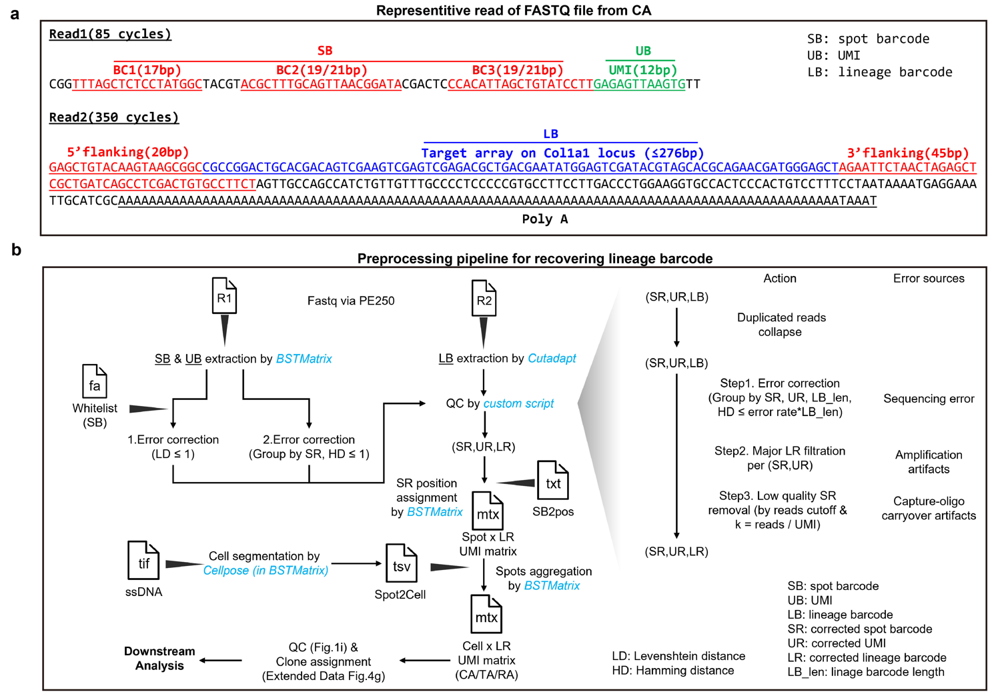

# Spatio_DARLIN

This is a Snakemake pipeline for automated preprocessing of spatial lineage tracing data from Spatio_DARLIN. 
Supported platforms: 
- [BMKMANU S3000](http://www.biomarker.com.cn/zhizao/s3000) 

The preprocessing pipeline includes:
- Lineage barcode identification and quality control
- Spatial barcode parsing
- Allele annotation ([darlin-core](https://github.com/JarningGau/darlin-core))
- Grouping spots into segmented cells
- Generating final clone-by-spots and clone-by-cells matrices

## Workflow



## Requirements

- **Conda**
- **BSTMatrix** (quantification pipeline for BMKMANU S3000; separate conda env named `BST-env`)
- **[darlin-core](https://github.com/JarningGau/darlin-core)** (GitHub only; installed via pip)

## Installation

### 1. Install BSTMatrix

```bash
cd /path/to/tools
wget http://www.bmkmanu.com/wp-content/uploads/2025/09/BSTMatrix_v2.4.f.4_release_20250902.zip -O BSTMatrix.zip
unzip BSTMatrix.zip
cd BSTMatrix
conda env create -n BST-env -f environment.yaml
export PATH=/path/to/tools/BSTMatrix:$PATH
```

### 2. Install spatio_darlin

```bash
git clone https://github.com/JarningGau/spatio_DARLIN --depth=1
cd spatio_DARLIN
kernel_name='spatio_darlin'
conda create -n $kernel_name python=3.9 --yes
conda activate $kernel_name
conda install snakemake=7.24.0 cutadapt umi_tools --yes
pip install papermill ipykernel matplotlib tqdm numpy
pip install "git+https://github.com/JarningGau/darlin-core.git@1.1.0"
pip install -e .
```

### 3. Verify installation

```bash
conda run -n $kernel_name bash bin/verify_environment.sh
```

On success the script prints `Analysis environment is ready!`

### Legacy MATLAB workflow (unmaintained)

The pre-1.0 MATLAB allele-calling path is deprecated and lives under [legacy/matlab/](legacy/matlab/). It requires MATLAB and [Custom_CARLIN](https://github.com/ShouWenWang-Lab/Custom_CARLIN). See [legacy/matlab/README.md](legacy/matlab/README.md).

## Usage

### Quick Start (Run Test)

To test the pipeline with example data:

```bash
conda activate $kernel_name
cd test
bash download_bmk.sh
```

This will download the test data. After downloading, run the test pipeline:

```bash
cd test_BMKS3000
bash test_bmk.sh
```

### Input Data Structure

The pipeline expects the following input data structure:

```
data/BMKS3000/
├── fastq/                    # Sequencing reads
│   ├── <sample>_<locus>_R1.fastq.gz
│   └── <sample>_<locus>_R2.fastq.gz
├── images/                   # Image files for BSTMatrix pipeline
│   ├── <sample>-FL.tif       # ssDNA, not neccessary when segmentation res-lts are provided.
│   ├── <sample>-HE.tif       # HE
│   └── <sample>-HE.txt       # Encoding positions of spatial barcodes
└── segmentation/             # Cell segmentation results from BSTMatrix
    └── <sample>/
        ├── all_barcode_num.txt      # Spots -> cellbin relationship, obtained when perform spatial mRNA-seq data preprocessing.
        └── barcodes_pos.tsv.gz      # Spatial barcode positions
```

**Input file descriptions:**
- **FASTQ files**: Paired-end sequencing reads. Naming convention: `<sample>_<locus>_R1.fastq.gz` and `<sample>_<locus>_R2.fastq.gz`, where `<locus>` can be `CA`, `RA`, or `TA`.
- **Image files**: Required for BSTMatrix pipeline
  - `<sample>-FL.tif`: Fluorescence image (ssDNA)
  - `<sample>-HE.tif`: H&E stained image
  - `<sample>-HE.txt`: Fluorescence decoding file (for spatial coordinates assignment)
- **Segmentation files**: Generated from BSTMatrix on mRNA data
  - `all_barcode_num.txt`: Maps spots to cell bins
  - `barcodes_pos.tsv.gz`: Spatial coordinates of cellbin

### Configuration Files

Each analysis requires a YAML configuration file. The test directory contains example configs:

```
test_BMKS3000/
├── config-CA.yaml    # Configuration for CA locus
├── config-RA.yaml    # Configuration for RA locus
└── config-TA.yaml    # Configuration for TA locus
```

### Configuration File Example

Below is an example configuration file with explanations:

```yaml
# Sample list to process
SampleList: ['L0927_Brain']
# Template type: 'Tigre_2022_v2' (TA), 'Rosa_v2' (RA), or 'cCARLIN' (CA)
template: 'cCARLIN'
# Directory paths (relative to the config file location)
raw_fastq_dir: '../data/BMKS3000/fastq'
image_dir: '../data/BMKS3000/images'
segmentation_dir: '../data/BMKS3000/segmentation'
outdir: 'CA'
# Cutadapt parameters
cutadapt:
  base_quality_cutoff: 10
  threads: 8
# BSTMatrix parameters
BSTMatrix:
  threads: 8
# QC parameters
QC:
  ## Step1. Correct sequencing error (errorous nucleotides)
  LB_error_rate: 0.02
  ## Step2. Remove amplification artifacts (chimeric molecules)
  major_fraction_threshold_molecule: 0.8
  ## Step3. Remove capture-oligo carryover artifacts (fake spots)
  ## (SR) spots with k = reads/UMIs >= this value
  slope_cutoff: 10
  ## (SR+UR+LR) molecules with supported reads >= this value
  reads_cutoff: 10
```

### Output Files

After a successful run with the bundled test configs (each sets `outdir` to the locus name), the workspace will resemble:

```text
test_BMKS3000/
├── CA/              # CA locus outputs (outdir: CA)
│   ├── BST_config/
│   ├── BST_output/
│   ├── cutadapt/
│   └── outs/
├── RA/              # RA locus outputs
├── TA/              # TA locus outputs
└── config-*.yaml    # Input configs (CA/RA/TA)
```

The final results live under each `outdir`, e.g. `test_BMKS3000/CA/outs/`:

```text
test_BMKS3000/CA/outs/
└── L0927_Brain_CA/
    ├── all.done
    ├── cellbin/        # Cell-bin level matrices
    ├── level_1         # spots-bin, level 1 matrices (3μm)
    ├── ...
    └── level_18        # spots-bin, level 18 matrices (99μm)
```

| Level           | 18   | 9    | 7    | 6    | 5    | 4    | 3    | 2    | 1    |
| --------------- | ---- | ---- | ---- | ---- | ---- | ---- | ---- | ---- | ---- |
| Resolution (μm) | 99   | 48   | 37   | 31   | 25   | 20   | 14   | 8    | 3    |

### Running the Pipeline

To run the pipeline with your own data:

1. Create a configuration file following the example above
2. Ensure your input data follows the expected structure
3. Run Snakemake:

```bash
conda activate spatio_darlin
snakemake --snakefile snakefiles/BMKS3000.smk --configfile <your_config.yaml> -c <cores> --use-conda
```

Replace `<your_config.yaml>` with the path to your configuration file and `<cores>` with the number of CPU cores to use.

## Additional Resources

- [Changelog](doc/CHANGELOG.md)
- Upstream analysis of BMKMANU S3000 spatial transcriptomics data: [doc/BMKS3000_upstream.md](doc/BMKS3000_upstream.md)
